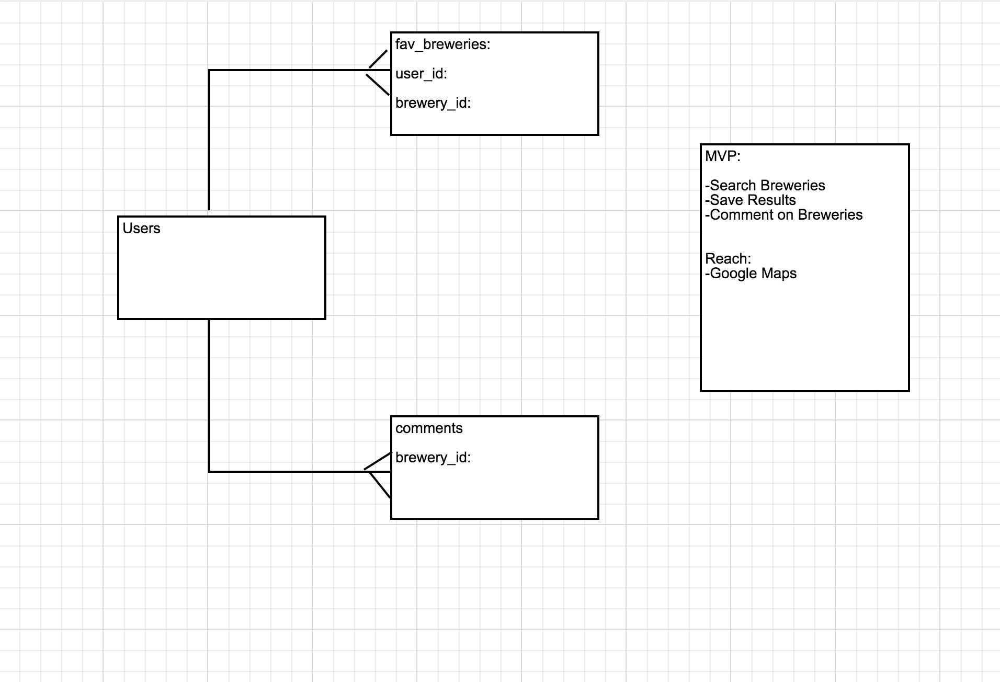

# Introduction
Welcome to Brew Search. The app that lets you search for breweries by name, established date, or location. Have you been to one of the breweries listed? If so add a comment! Would you like to save a list of breweries you'd like to visit? Add them to your list!

# Website
https://warm-plains-66444.herokuapp.com/

##User Stories
* User
    * User can search based on name, established date
    * User can signup, login, logout
    * User can save breweries 

##Technologies Used

* Ruby on Rails- MVC framework 
* PSQL- store our data
* Bcrypt- hash user's password
  
####APIs Used 

  * [BreweryDB](http://www.brewerydb.com/developers) 

##Wireframes

ERD:

##References and Special Thanks
* Rails authentication- codecademy tutorial on how to add user, signup, login, and logout. [Codecademy](https://www.codecademy.com/learn/rails-auth)

* Special thanks to my classmates for support, especially James and Arlen with my saved breweries and functionality of my database.

